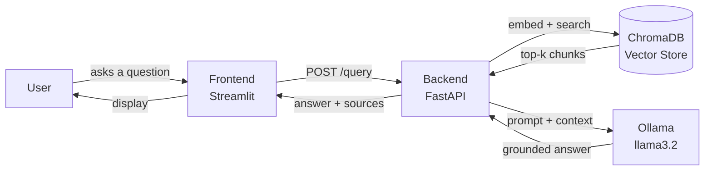

# NutriChat

A RAG (Retrieval-Augmented Generation) assistant that answers nutrition and healthy-eating questions using official USDA and WHO/FAO guidance — grounded, cited answers, running entirely on a local LLM (no external API calls, no data leaving your machine).

Built as a graduation project for Level 2 Summer Training (Core Track — text-only RAG).

## Overview

NutriChat lets a user ask a plain-language nutrition question (e.g. "How much sodium is recommended per day?") and get back an answer grounded in real source documents, with citations showing exactly which document the answer came from — instead of the LLM guessing from its own training data.

The pipeline: source PDFs → chunked and embedded → stored in a local vector database → a question retrieves the most relevant chunks → those chunks + the question are sent to a local Ollama LLM → the model answers using only that retrieved context, citing its sources.

## Architecture



## Tech Stack

| Layer | Technology |
|---|---|
| Notebook / data pipeline | Jupyter, docling (PDF parsing), LangChain text splitters |
| Embeddings | sentence-transformers (`all-MiniLM-L6-v2`) |
| Vector database | ChromaDB (persisted locally) |
| LLM | Ollama, running `llama3.2` locally |
| Backend | FastAPI, Pydantic, pydantic-settings, Uvicorn |
| Frontend | Streamlit |
| Testing | pytest, FastAPI TestClient |
| Containerization | Docker |

## Project Structure

```
NutriChat/
├── Data/                       # Source PDFs (USDA, WHO/FAO)
├── notebooks/
│   └── Rag_pipline.ipynb       # Full pipeline: load, chunk, embed, retrieve, evaluate
├── vector_db/                  # Persisted ChromaDB store produced by the notebook
├── eval_results.csv            # Raw evaluation output (Phase 2.6)
├── backend/
│   ├── app/
│   │   ├── main.py             # FastAPI app, CORS, startup loading
│   │   ├── api/routes/query.py # GET /health, POST /query
│   │   ├── core/config.py      # Settings from .env
│   │   ├── schemas/query.py    # QueryRequest / QueryResponse
│   │   ├── services/
│   │   │   ├── retrieval.py    # Load vector store, retrieve chunks
│   │   │   └── generation.py   # Call Ollama LLM, build answer
│   │   └── utils/logging_config.py
│   ├── data/vector_db/         # Backend's own copy of the persisted vector store
│   ├── tests/test_query.py
│   ├── requirements.txt
│   ├── .env.example
│   └── Dockerfile
├── frontend/
│   ├── app.py                  # Streamlit chat interface
│   ├── api_client.py           # Wrapper for calling the backend API
│   ├── .env.example
│   └── requirements.txt
└── README.md
```

## Domain & Data

**Domain:** Nutrition and healthy eating.

**Sources** (all official, public-domain or freely licensed):

| Document | Publisher | Description |
|---|---|---|
| `Dietary_Guidelines_for_Americans_2020-2025.pdf` | USDA / HHS | Primary source — 164 pages, chapters covering nutrition across life stages (infants, children, adults, pregnancy, older adults), nutrients of concern, and dietary patterns |
| `9789240101876-eng.pdf` | FAO/WHO | "What are healthy diets?" — joint report defining a healthy diet via four principles: adequacy, balance, moderation, diversity |
| `WHO_healthy_diet_factsheet.pdf` | WHO | Short global fact sheet on healthy diet recommendations and health risks of poor diets |

All documents were verified as native, text-extractable PDFs (no scanned pages requiring OCR). A small number of pages containing mostly graphics (e.g. plate diagrams) were flagged during inspection and left as-is per the notebook's Phase 2.1 analysis — no OCR or image processing is performed, consistent with the Core Track scope.

## Setup

### Prerequisites

- Python 3.10+
- [Ollama](https://ollama.com) installed, with the `llama3.2` model pulled:
  ```
  ollama pull llama3.2
  ```
- Git

### Backend

```bash
cd backend
python3 -m venv .venv
source .venv/bin/activate        # Windows: .venv\Scripts\activate
pip install -r requirements.txt
cp .env.example .env             # defaults work out of the box for local use
uvicorn app.main:app --reload
```

Backend runs at `http://localhost:8000`. Verify it's working:
- `http://localhost:8000/health` → `{"status": "ok"}`
- `http://localhost:8000/docs` → interactive Swagger UI

Run the tests:
```bash
pytest tests/ -v
```

### Frontend

In a **separate terminal** (backend must be running):

```bash
cd frontend
python3 -m venv .venv
source .venv/bin/activate        # Windows: .venv\Scripts\activate
pip install -r requirements.txt
cp .env.example .env             # defaults work out of the box for local use
streamlit run app.py
```

Frontend opens at `http://localhost:8501`. Ask a nutrition question and you should see a grounded, cited answer.

### Rebuilding the pipeline from scratch (optional)

The vector store is already included in this repo (`vector_db/` and `backend/data/vector_db/`), so the steps above work without rebuilding anything. If you want to regenerate it from the source PDFs:

```bash
cd notebooks
jupyter notebook
# Open Rag_pipline.ipynb, Kernel → Restart & Run All
# Then copy the resulting vector_db/ into backend/data/vector_db/
```

## Environment Variables

**backend/.env**

| Variable | Default | Description |
|---|---|---|
| `VECTOR_DB_PATH` | `./data/vector_db` | Path to the persisted ChromaDB store |
| `COLLECTION_NAME` | `nutrichat_knowledge` | Chroma collection name (must match the notebook) |
| `EMBEDDING_MODEL` | `all-MiniLM-L6-v2` | sentence-transformers model used for embeddings (must match the notebook) |
| `LLM_MODEL` | `llama3.2` | Ollama model used for generation |
| `TOP_K` | `4` | Number of chunks retrieved per query |
| `FRONTEND_URL` | `http://localhost:8501` | Allowed CORS origin for the frontend |

**frontend/.env**

| Variable | Default | Description |
|---|---|---|
| `API_BASE_URL` | `http://localhost:8000` | Base URL of the backend API |

## API Reference

### `GET /health`

Liveness check.

**Response:**
```json
{"status": "ok"}
```

### `POST /query`

Ask a nutrition question and get a grounded, cited answer.

**Request:**
```json
{"question": "How much sodium is recommended per day for adults?"}
```

**Response:**
```json
{
  "answer": "According to the Dietary Guidelines for Americans, adults should limit sodium intake to less than 2,300 mg per day (Source 1)...",
  "sources": ["Dietary_Guidelines_for_Americans_2020-2025.pdf"]
}
```

**curl example:**
```bash
curl -X POST http://localhost:8000/query \
  -H "Content-Type: application/json" \
  -d '{"question": "How much sodium is recommended per day for adults?"}'
```

## Evaluation Results

Tested against 12 questions (11 on-topic, 1 deliberately off-topic control) — full details and grading rationale in `notebooks/Rag_pipline.ipynb`, Section 2.6, and raw output in `eval_results.csv`.

**Summary:** 9/12 grounded, 3/12 partially grounded, 0/12 hallucinated.

The off-topic control question ("What is the capital of France?") was correctly refused by the model ("I don't have enough information in my sources to answer that.") rather than answered from outside knowledge — confirming the grounding/refusal instruction in the prompt works as intended.

**Main failure patterns observed:** retrieval occasionally pulled a technically-relevant chunk that answered a related but slightly different version of the question (e.g. a specific food subcategory presented as the general recommendation, or a source's number correctly retrieved but attributed to the wrong document in the citation). No answers fabricated information outright — every failure was a retrieval/attribution issue, not the model inventing facts. Full analysis in the notebook.

## Screenshots

*(Add screenshots of the Streamlit chat interface and a sample Q&A here before final submission.)*

## Notes

- Docker builds for this backend can be very slow on Apple Silicon due to platform emulation. If building locally on an M-series Mac, use:
  ```bash
  docker build --platform linux/arm64 -t nutrichat-backend .
  ```
- This is the Core Track submission (text-only RAG). No CV/YOLO component is included.
